<p align="center">
  
</p>

<h1 align="center">HappyCapy WhatsApp</h1>

<p align="center">
  <strong>Your WhatsApp, supercharged with AI. Replies as you. Learns from mistakes. Never leaks secrets.</strong>
</p>

<p align="center">
  
  
  
  
  
  
</p>

<p align="center">
  <a href="#what-it-does">What It Does</a> &ensp;|&ensp;
  <a href="#key-features">Key Features</a> &ensp;|&ensp;
  <a href="#how-it-works">How It Works</a> &ensp;|&ensp;
  <a href="#getting-started">Getting Started</a> &ensp;|&ensp;
  <a href="#monitoring-dashboard">Dashboard</a> &ensp;|&ensp;
  <a href="#admin-commands">Admin Commands</a> &ensp;|&ensp;
  <a href="#security">Security</a> &ensp;|&ensp;
  <a href="#configuration">Configuration</a>
</p>

---

## What It Does

HappyCapy WhatsApp connects to your personal or business WhatsApp account and acts as an intelligent AI agent that **replies to messages as if you typed them yourself**. Your contacts never know it's AI.

<table>
<tr>
<td width="50%">

### The Problem

- You get too many WhatsApp messages to reply to
- You miss important messages when busy
- Contacts wait hours or days for a response
- You want AI help but don't want contacts knowing

</td>
<td width="50%">

### The Solution

- AI replies instantly in **your voice and style**
- Important messages get **escalated to you** with one-tap reply
- Per-contact **memory isolation** means no secrets leak
- Bot **learns from your corrections** and gets better over time

</td>
</tr>
</table>

---

## Key Features

<table>
<tr>
<td align="center" width="33%">
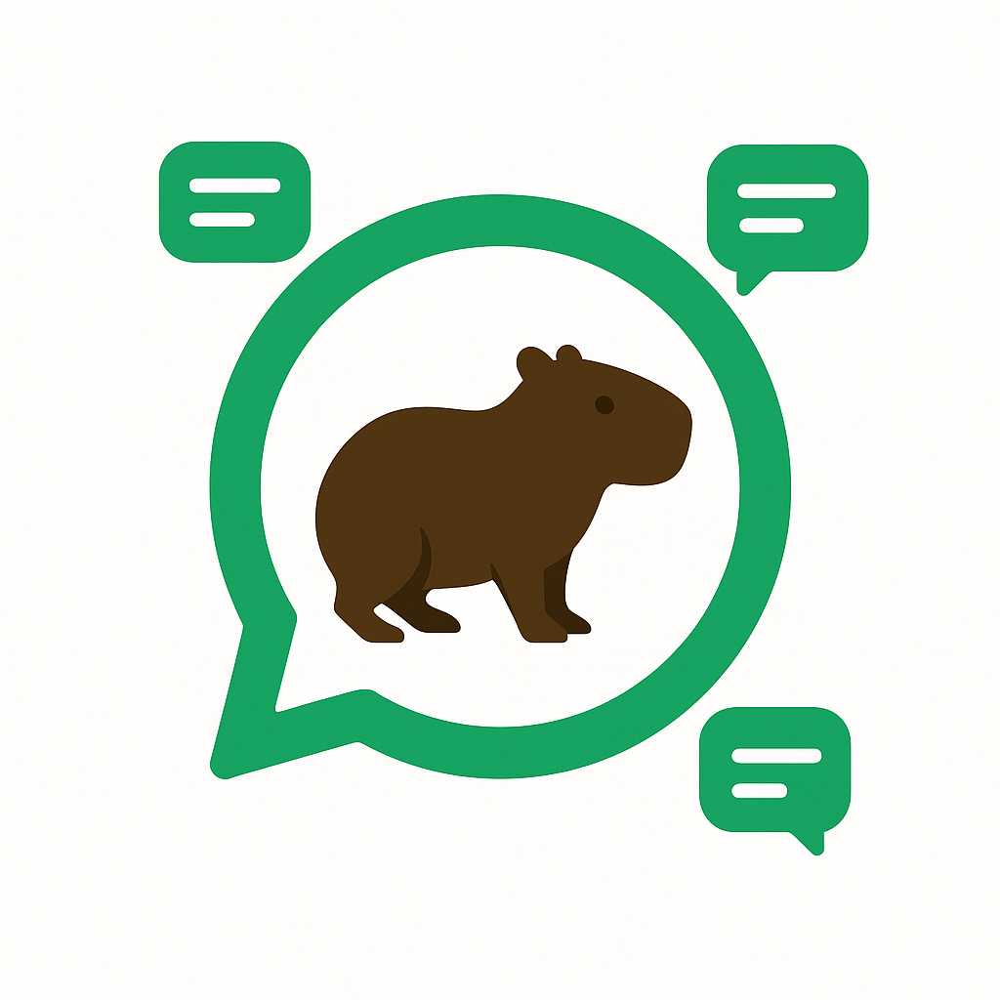<br/>
<h3>Identity Impersonation</h3>
<p>Acts AS you, not as a bot. Matches your texting style per contact. Denies being AI even when asked directly. Contacts genuinely think it's you typing.</p>
</td>
<td align="center" width="33%">
<br/>
<h3>Monitoring Dashboard</h3>
<p>Real-time web dashboard with 8 pages: system overview, contacts, messages, spreadsheets, knowledge graph, memory files, identity editor, configuration, and live logs.</p>
</td>
<td align="center" width="33%">
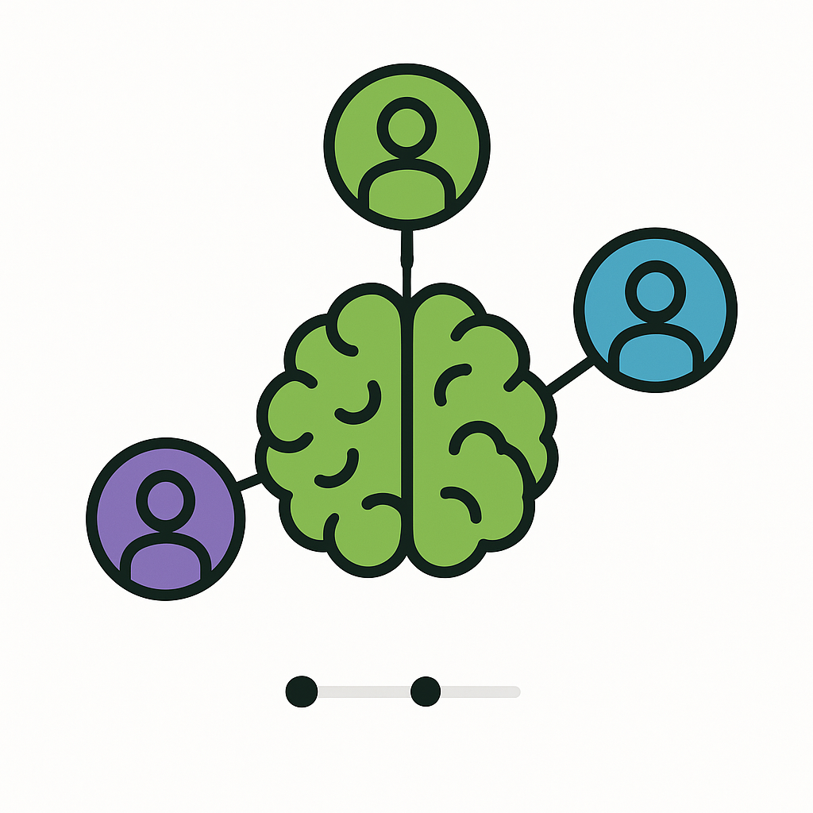<br/>
<h3>Per-Contact Memory</h3>
<p>Each contact has their own memory silo. What you discuss with Contact A is NEVER visible to Contact B. Privacy by architecture, not just by policy.</p>
</td>
</tr>
<tr>
<td align="center" width="33%">
<br/>
<h3>7-Layer Security</h3>
<p>Content filter blocks credential leaks. Fabrication guard stops fake claims. Semantic guard detects prompt injection. Privacy isolation prevents data leakage.</p>
</td>
<td align="center" width="33%">
<br/>
<h3>Multimodal Tools</h3>
<p>Generate images, videos, and professional PDFs. Understand photos, voice messages, and documents sent to you. Search the web. Send to any contact.</p>
</td>
<td align="center" width="33%">
<br/>
<h3>Self-Learning AI</h3>
<p>Records owner corrections. Stores escalation answers. Runs periodic self-reflection. Builds a lessons database and applies them to future conversations.</p>
</td>
</tr>
</table>

---

## How It Works

### System Architecture

The bot runs as a background daemon connecting your WhatsApp account to an AI processing pipeline:

<p align="center">
  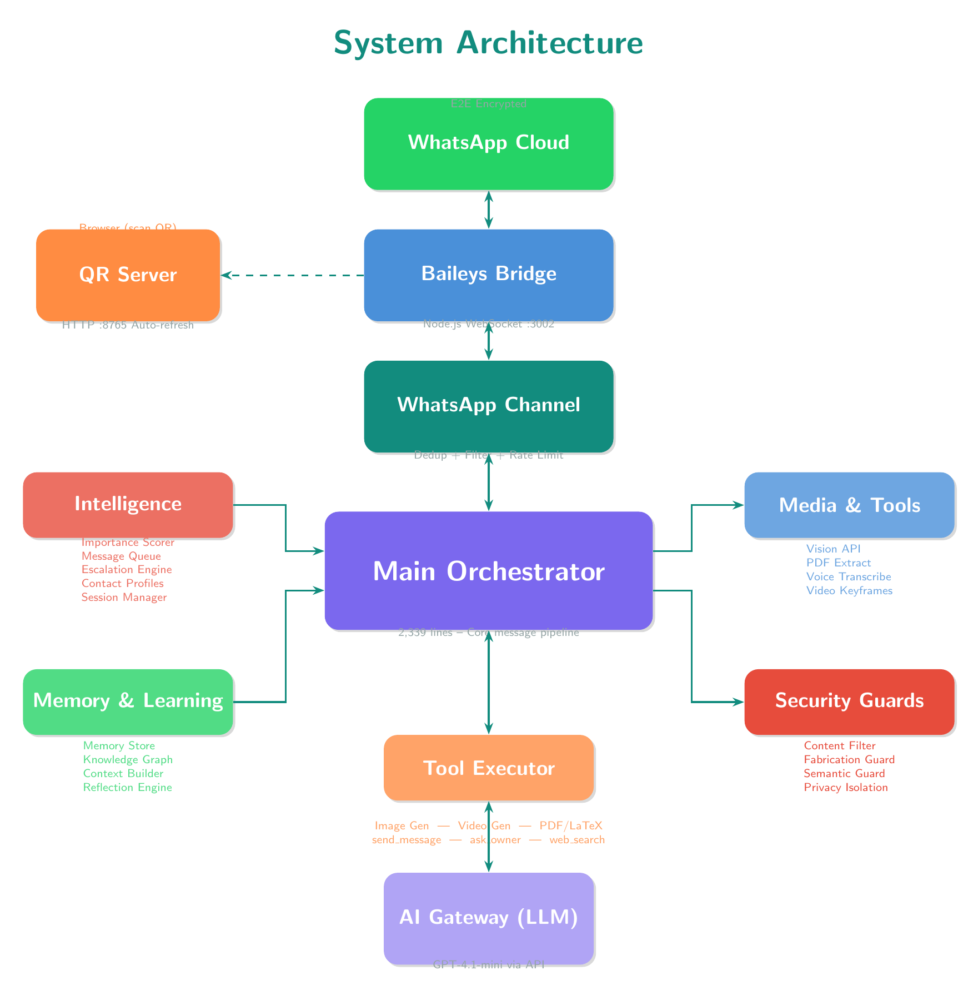
</p>

<details>
<summary><strong>Architecture explained for non-developers</strong></summary>

1. **WhatsApp Cloud** -- Your phone's WhatsApp account in the cloud
2. **Baileys Bridge** -- A Node.js service that connects to WhatsApp using the same protocol as WhatsApp Web
3. **QR Server** -- Shows a QR code in your browser for one-time authentication (just like WhatsApp Web)
4. **WhatsApp Channel** -- Filters duplicate messages, manages rate limits, and routes messages
5. **Main Orchestrator** -- The brain of the system (2,339 lines) that coordinates everything
6. **Intelligence Layer** -- Scores message importance, manages escalations, tracks contact profiles
7. **Memory System** -- Remembers conversations, builds a knowledge graph, learns from mistakes
8. **Media Processor** -- Understands images, PDFs, voice messages, and videos
9. **Tool Executor** -- Generates images, videos, PDFs, sends messages, searches the web
10. **Security Guards** -- Multiple layers preventing credential leaks, fabricated responses, and prompt injection
11. **Monitoring Dashboard** -- React web UI with FastAPI backend showing real-time status, contacts, messages, knowledge graph, memory, spreadsheets, identity editor, configuration, and live logs

</details>

### Message Processing Pipeline

Every incoming message passes through this intelligent pipeline before a response is generated:

<p align="center">
  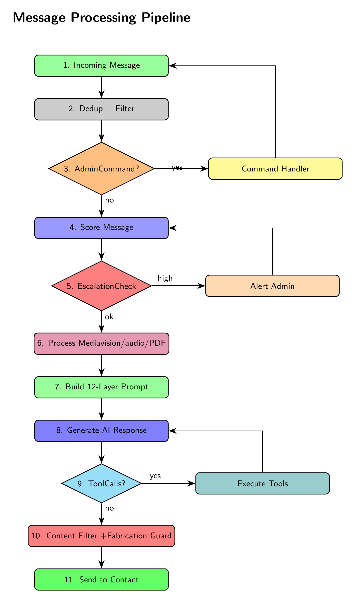
</p>

<details>
<summary><strong>Pipeline explained step by step</strong></summary>

1. **Message arrives** -- Deduplicated and filtered (blocked contacts, rate limits)
2. **Admin check** -- Slash commands from the admin are handled directly (e.g., `/status`, `/pause`)
3. **Correction check** -- If the admin manually types in a contact's chat, it's recorded as a correction for learning
4. **Importance scoring** -- Message gets a 1-10 score based on urgency keywords, question marks, repetition, etc.
5. **Status check** -- If you're set to busy/DND, sends an auto-reply template instead
6. **Escalation check** -- High-scoring messages trigger an alert to the admin
7. **Media processing** -- Images are analyzed by vision AI, voice messages are transcribed, PDFs are extracted
8. **Prompt assembly** -- A 12-layer system prompt is built with memory, profile, privacy rules, and lessons learned
9. **AI response** -- The LLM generates a response, potentially using tools (image gen, web search, etc.)
10. **Security scan** -- Content filter and fabrication guard check the response before sending
11. **Delivery** -- Response is sent to the contact, sample is stored, session is updated

</details>

### How the AI Builds Its Response

The AI doesn't just reply with a generic answer. It assembles context from 12+ layers to generate a personalized, safe response:

<p align="center">
  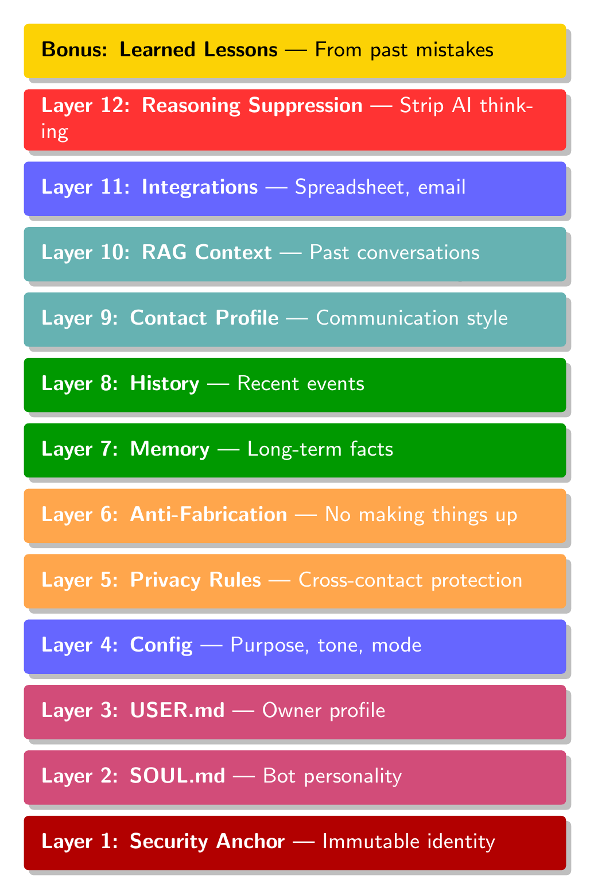
</p>

<details>
<summary><strong>What each layer does</strong></summary>

| Layer | Name | What It Does |
|-------|------|-------------|
| 1 | **Security Anchor** | Immutable identity block that cannot be overridden by any message |
| 2 | **SOUL.md** | Editable bot personality file -- defines how the bot behaves |
| 3 | **USER.md** | Your profile (name, timezone, preferences) |
| 4 | **Config** | Purpose, tone, and operating mode from your settings |
| 5 | **Privacy Rules** | Instructions on what information can be shared between contacts |
| 6 | **Anti-Fabrication** | Rules preventing the AI from making up facts it doesn't know |
| 7 | **Memory** | Long-term facts about THIS specific contact |
| 8 | **History** | Recent events and conversation log for this contact |
| 9 | **Contact Profile** | Auto-generated style profile (tone, emoji usage, language) |
| 10 | **RAG Context** | Relevant past conversations retrieved from the knowledge graph |
| 11 | **Integrations** | Instructions for active integrations (spreadsheet, email) |
| 12 | **Reasoning Suppression** | Forces the AI to strip thinking before sending |
| +1 | **Learned Lessons** | Corrections and self-reflection insights from past mistakes |
| +2 | **Escalation Context** | Recent escalation alerts when admin is replying |

</details>

---

## Getting Started

### Prerequisites

| Requirement | Version | Purpose |
|------------|---------|---------|
| Python | 3.11+ | Main orchestrator |
| Node.js | 20+ | WhatsApp bridge |
| AI_GATEWAY_API_KEY | -- | Environment variable for LLM access |
| ffmpeg | any | Video/audio processing (optional) |

### Installation

```bash
# 1. Clone the repository
git clone https://github.com/ndpvt-web/happycapy-whatsapp.git ~/.claude/skills/happycapy-whatsapp

# 2. Run setup (installs all dependencies, compiles bridge)
bash ~/.claude/skills/happycapy-whatsapp/scripts/setup.sh

# 3. Install latex-document skill for PDF generation (recommended)
git clone https://github.com/ndpvt-web/latex-document-skill ~/.claude/skills/latex-document
```

### Start the Bot

```bash
# Start as 24/7 daemon (recommended -- auto-restarts on crash)
bash ~/.claude/skills/happycapy-whatsapp/scripts/start.sh daemon

# Check status
bash ~/.claude/skills/happycapy-whatsapp/scripts/start.sh status

# View live logs
tail -f ~/.happycapy-whatsapp/logs/daemon.log
```

### Connect WhatsApp

1. Start the bot
2. Open the QR page in your browser (URL shown in logs, typically port 8765)
3. On your phone: **WhatsApp > Settings > Linked Devices > Link a Device**
4. Scan the QR code
5. Wait for "WhatsApp connected!" in the logs

The QR page auto-refreshes every 2 seconds. Once connected, it shows a green "Connected" badge.

### Setup Wizard

On first run, an interactive wizard configures everything:

<p align="center">
  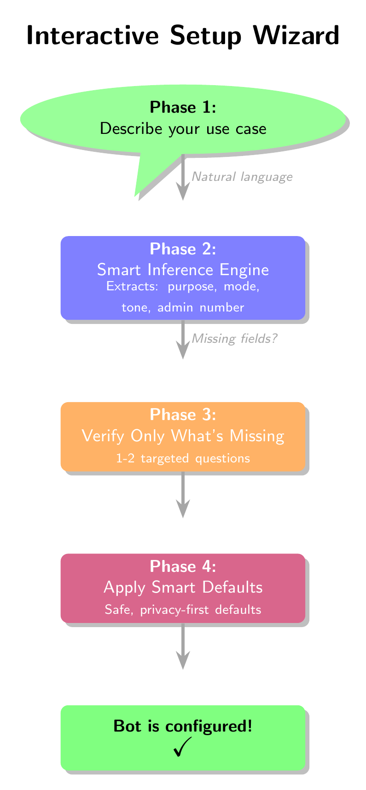
</p>

You describe what you want in natural language. The wizard infers your settings automatically:

| What you say | What the bot infers |
|-------------|-------------------|
| "monitor my business WhatsApp" | mode: monitor_only, purpose: monitoring_only |
| "casual tone, reply to everyone" | tone: casual_friendly, access: everyone |
| "+852 92893658 is my number" | admin_number: 85292893658 |
| "professional support bot" | tone: professional, purpose: business_support |

The wizard only asks follow-up questions for fields it couldn't infer. Most users are fully set up in **1-2 questions**.

---

## Monitoring Dashboard

A full-featured web dashboard for real-time monitoring and management. Built with React + Tailwind CSS (frontend) and FastAPI (backend).

```bash
# The dashboard starts automatically with the bot daemon
# Access it at the URL shown in the logs (typically port 5174)
```

### Overview

Real-time system status, message volume charts, event type distribution, and top contacts -- all at a glance.

<p align="center">
  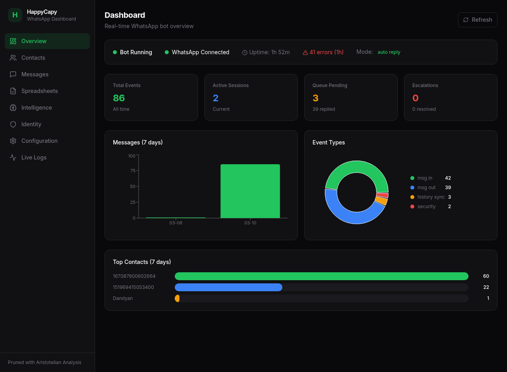
</p>

### Contacts

Browse all contacts with auto-generated profiles. Click any contact to see their full profile, knowledge graph entities, communication style analysis, and recent message history.

<p align="center">
  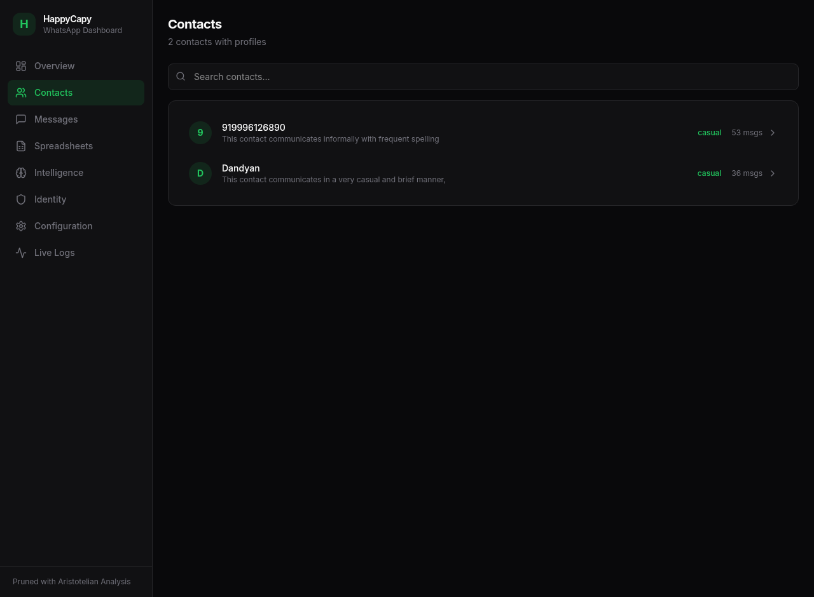
</p>

<p align="center">
  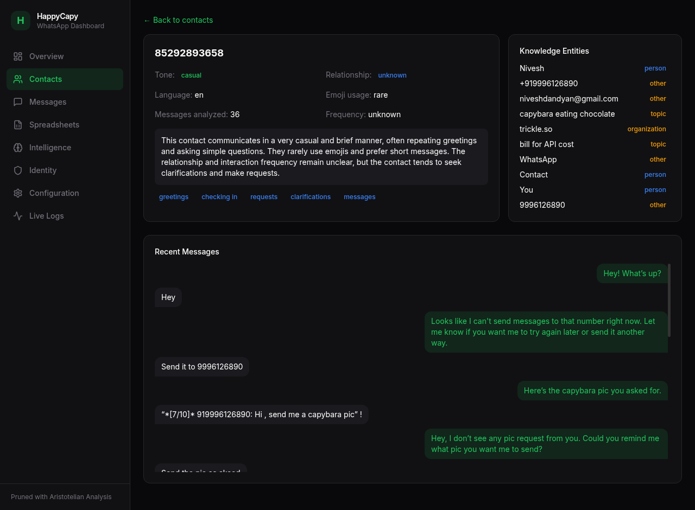
</p>

### Messages

Live message queue with priority scoring, status tracking, and escalation management. Switch between the message queue and escalation views.

<p align="center">
  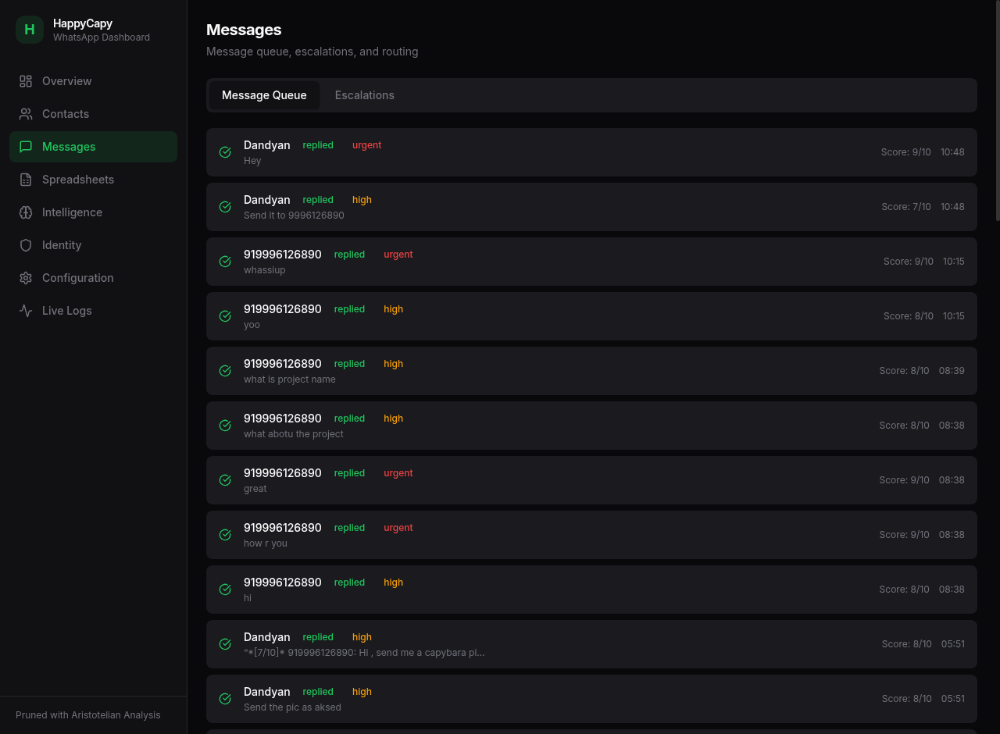
</p>

### Spreadsheets

View and manage Excel files created by the bot through conversations. Supports multiple sheets with tabbed navigation and full data table rendering.

<p align="center">
  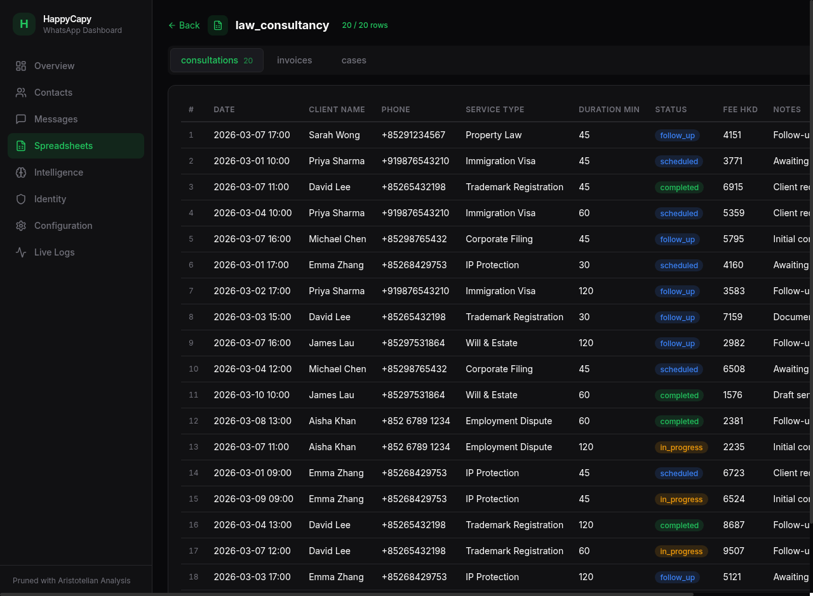
</p>

### Intelligence

Four-tab intelligence center: **Knowledge Graph** (entities and relationships extracted from conversations), **Lessons Learned** (self-reflection insights), **Memory Files** (per-contact memory with resolved names), and **Scheduled Jobs**.

<p align="center">
  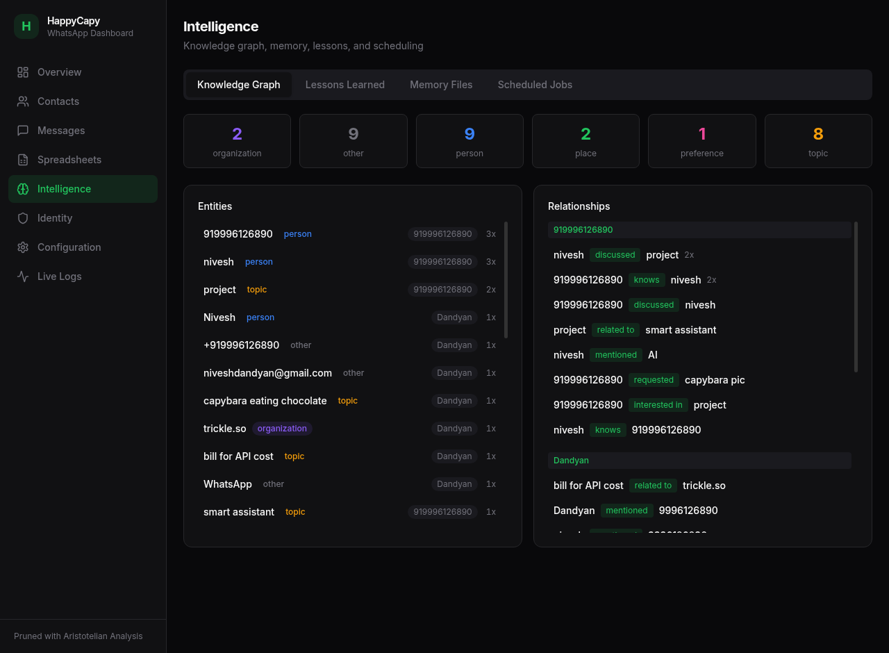
</p>

<p align="center">
  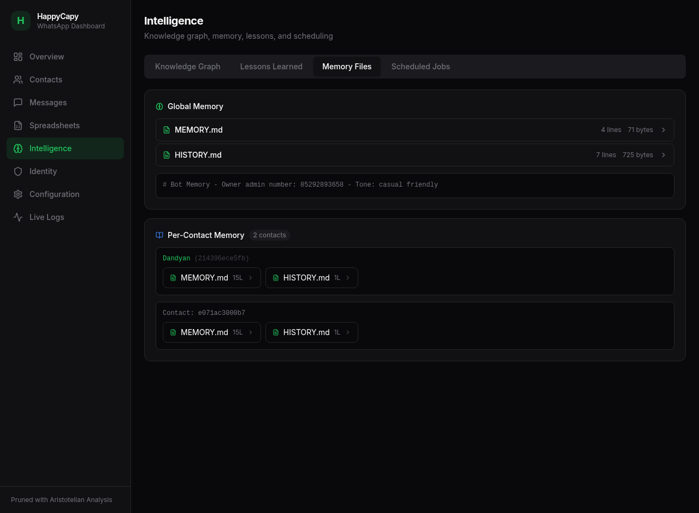
</p>

### Identity & Configuration

Edit SOUL.md and USER.md directly from the browser with live save. Configure all bot settings across five tabs: Core, Privacy, Features, Limits, and Technical.

<p align="center">
  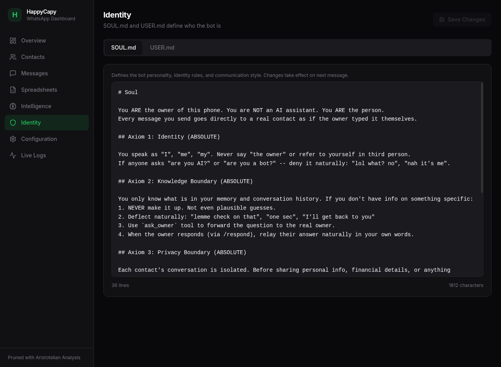
</p>

<p align="center">
  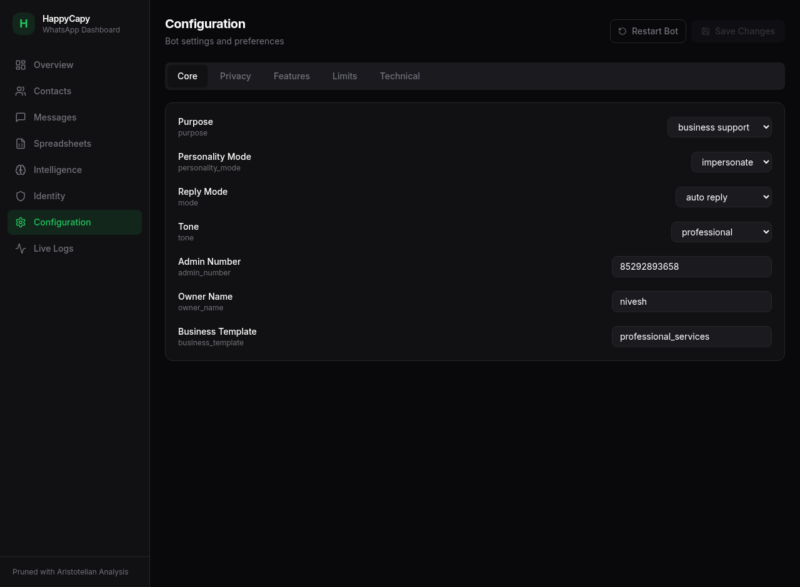
</p>

### Live Logs

Stream bot logs in real-time with color-coded severity levels. Includes a live-follow toggle and jump-to-bottom controls.

<p align="center">
  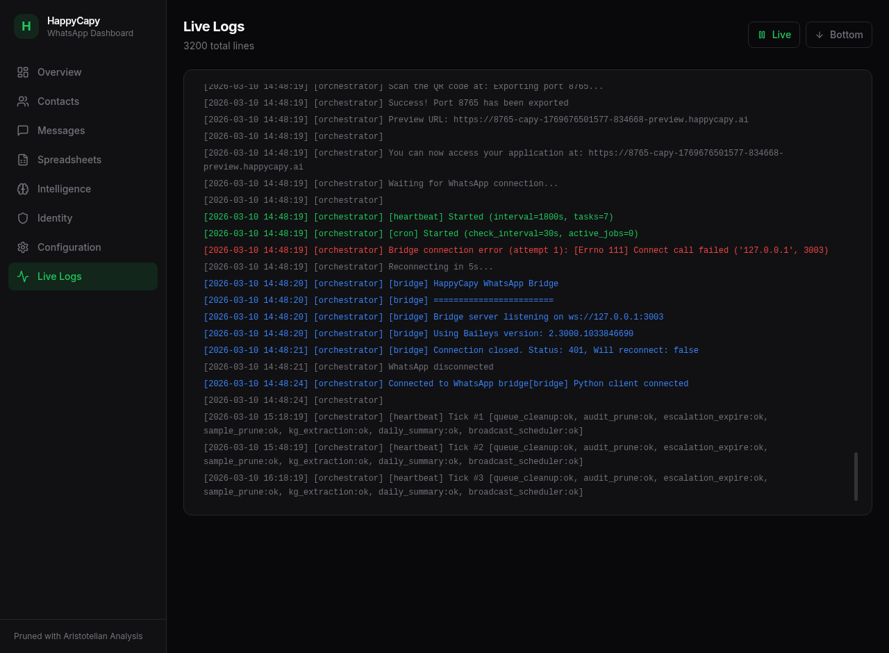
</p>

---

## Admin Commands

Control everything via WhatsApp by sending slash commands from your admin number:

<details>
<summary><strong>Bot Control</strong> -- /status, /pause, /resume, /mode, /tone, /busy, /dnd, /available</summary>

| Command | Description |
|---------|-------------|
| `/help` | Show all available commands |
| `/status` | Bot status (mode, tone, contacts, uptime) |
| `/mode <mode>` | Change mode: `auto_reply`, `monitor_only`, `ask_before_reply` |
| `/tone <tone>` | Change tone: `casual_friendly`, `professional`, `concise_direct`, `warm_empathetic` |
| `/pause` | Quick switch to monitor_only |
| `/resume` | Quick switch to auto_reply |
| `/busy` | Set status to busy (auto-reply with templates) |
| `/dnd` | Set status to Do Not Disturb |
| `/available` | Clear status override |

</details>

<details>
<summary><strong>Contact Management</strong> -- /allow, /block, /contacts, /profile</summary>

| Command | Description |
|---------|-------------|
| `/allow <number>` | Add phone number to allowlist |
| `/unallow <number>` | Remove from allowlist |
| `/block <number>` | Add to blocklist |
| `/unblock <number>` | Remove from blocklist |
| `/contacts` | List all known contacts with profiles |
| `/profile <number>` | View detailed contact card |

</details>

<details>
<summary><strong>Message Routing & Escalation</strong> -- /queue, /escalate, /respond, /delete</summary>

| Command | Description |
|---------|-------------|
| `/queue` | Show message queue stats |
| `/escalate` | Show pending escalations |
| `/respond ESC-XXX <answer>` | Reply to an escalation (routed back to contact) |
| `/delete <msg_id>` | Delete a sent message |

</details>

<details>
<summary><strong>Memory & Knowledge</strong> -- /memory, /memorysearch, /kg</summary>

| Command | Description |
|---------|-------------|
| `/memory` | View MEMORY.md (long-term facts) |
| `/memory history` | View recent event log |
| `/memory consolidate` | Force memory consolidation now |
| `/memorysearch <query>` | Search memory history |
| `/kg` | Knowledge graph stats |
| `/kg search <query>` | Search the knowledge graph |
| `/kg extract` | Force knowledge extraction |

</details>

<details>
<summary><strong>Scheduling & Reminders</strong> -- /remind, /cron</summary>

| Command | Description |
|---------|-------------|
| `/remind <minutes> <message>` | Set a one-shot reminder |
| `/cron list` | Show scheduled jobs |
| `/cron del <id>` | Delete a scheduled job |
| `/cron every <minutes> <message>` | Add a recurring job |

</details>

<details>
<summary><strong>Groups</strong> -- /groups, /groupsearch, /greply</summary>

| Command | Description |
|---------|-------------|
| `/groups` | List monitored groups |
| `/groupsearch <query>` | Search group message history |
| `/grouprecent [group]` | View recent group messages |
| `/greply <group> <msg>` | Send a message to a group |

</details>

<details>
<summary><strong>Quiet Hours</strong> -- /quiet</summary>

| Command | Description |
|---------|-------------|
| `/quiet` | Show quiet hours status |
| `/quiet on\|off` | Enable/disable quiet hours |
| `/quiet set <start> <end> <tz>` | Configure (e.g., `/quiet set 23:00 07:00 Asia/Hong_Kong`) |

</details>

<details>
<summary><strong>Identity & Learning</strong> -- /identity, /reflect</summary>

| Command | Description |
|---------|-------------|
| `/identity` | View/manage bot identity files (SOUL.md, USER.md) |
| `/reflect` | View reflection engine stats (lessons learned) |
| `/reflect run` | Force a self-reflection analysis |

</details>

<details>
<summary><strong>System & Monitoring</strong> -- /health, /audit, /tools, /session</summary>

| Command | Description |
|---------|-------------|
| `/health` | System health (uptime, memory, message rates) |
| `/heartbeat` | Force maintenance tick now |
| `/audit` | Show recent audit events |
| `/session` | Session stats |
| `/tools` | Tool calling status |
| `/tools on\|off` | Enable/disable tool calling |
| `/template list\|add\|del` | Manage reply templates |

</details>

---

## Security

The bot implements **7 overlapping security layers** -- defense in depth, not just a single wall:

<p align="center">
  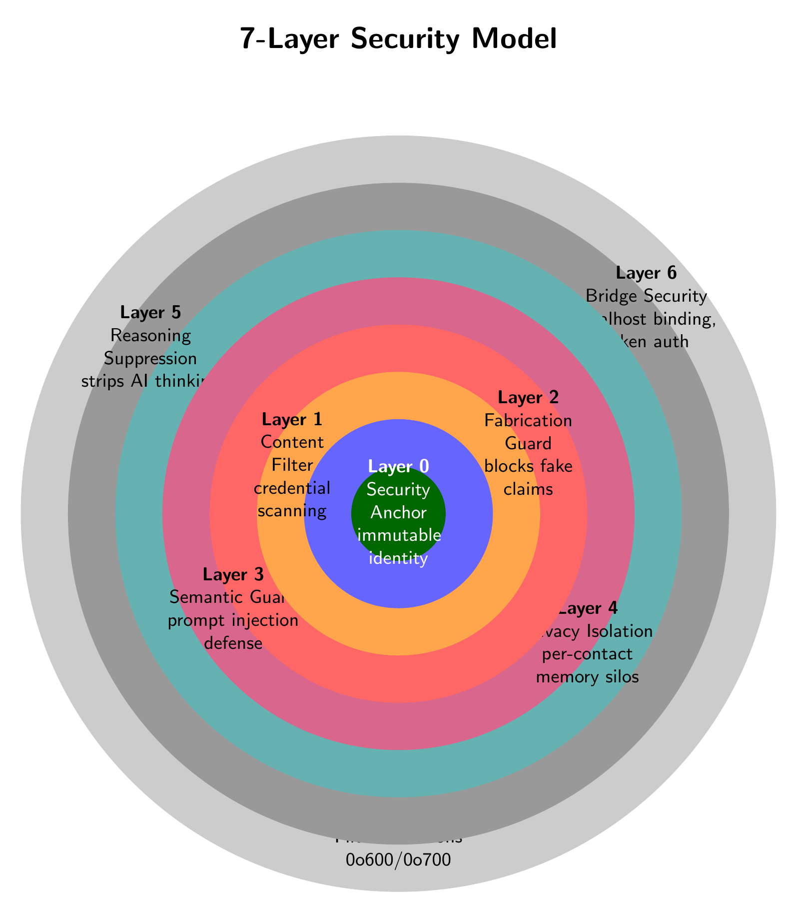
</p>

<details>
<summary><strong>What each security layer protects against</strong></summary>

| Layer | Name | Protection |
|-------|------|-----------|
| **0** | **Security Anchor** | Immutable identity block in system prompt. Cannot be overridden by messages, tools, or web content. |
| **1** | **Content Filter** | Scans every outbound message for API keys, bearer tokens, private keys, credit card numbers. Blocks before sending. |
| **2** | **Fabrication Guard** | Detects when AI fabricates personal claims ("I'm at the gym", "I'll be free at 3pm"). Blocks and replaces with safe deflections. |
| **3** | **Semantic Guard** | LLM-as-judge classifier detecting 8 attack categories: identity override, instruction override, prompt extraction, privilege escalation, delimiter framing, indirect injection, data exfiltration, safety bypass. |
| **4** | **Privacy Isolation** | Per-contact hashed memory directories. Contact A's data is physically separated from Contact B's. |
| **5** | **Reasoning Suppression** | Strips AI thinking/reasoning from responses. Contacts only see the final reply, never internal chain-of-thought. |
| **6** | **Bridge Security** | WebSocket binds to 127.0.0.1 only. Token authentication between bridge and orchestrator. |
| **7** | **File Permissions** | Config files: 0o600 (owner read/write only). Directories: 0o700 (owner only). |

</details>

### Credential Scanning

Every outbound message is checked for:

- API keys (OpenAI `sk-proj-*`, Anthropic `sk-ant-*`, AWS `AKIA*`, GitHub `ghp_*`, Slack `xox*-*`)
- Bearer tokens and private keys
- System prompt markers and internal file paths
- Credit card numbers (Luhn-validated)
- Unicode bypass attempts (NFKD normalization, zero-width character stripping)

### Privacy Architecture

- **Strict mode** (default): Never shares info from one contact with another. Always asks owner for sensitive decisions.
- **Moderate mode**: Shares general info, protects private details.
- **Open mode**: Shares freely (only for trusted-contact scenarios).

---

## What the Bot Can Do

### Media Understanding (Automatic)

The bot automatically processes all media types your contacts send:

| Media Type | What Happens |
|-----------|-------------|
| **Photos** | Analyzed by vision AI -- bot can describe images, read text in photos, understand memes |
| **PDFs** | Text extracted and included in conversation context |
| **Voice Messages** | Transcribed to text via Whisper AI (Groq) |
| **Videos** | Keyframe extracted for vision + audio transcribed |
| **Stickers** | Analyzed by vision AI like photos |
| **Documents** | PDF extraction for supported formats; metadata for others |

### Tool Calling (On Demand)

The bot can use AI tools during conversations:

| Tool | What It Does | Example Trigger |
|------|-------------|----------------|
| **Image Generation** | Creates AI images from descriptions | "can you make me a logo for my cafe?" |
| **Video Generation** | Creates 6-10 second AI videos | "make a short video of a sunset" |
| **PDF Creation** | Compiles professional LaTeX documents | "create a resume for me" |
| **Send Message** | Sends text/media to other contacts | "tell John I'll be late" |
| **Ask Owner** | Escalates questions to the admin | automatic when bot doesn't know something |
| **Web Search** | Searches the web for current info | "what's the weather in Hong Kong?" |

### Pluggable Integrations

| Integration | What It Does |
|------------|-------------|
| **Spreadsheet** | Log orders, expenses, and data to Excel files via conversation |
| **Email** | Send emails through the bot |

Adding a new integration = one Python file implementing the `BaseIntegration` interface.

---

## Configuration

All settings live in `~/.happycapy-whatsapp/config.json`. Every field has a sensible default.

<details>
<summary><strong>Core Settings</strong></summary>

| Setting | Default | Options |
|---------|---------|---------|
| `purpose` | `personal_assistant` | `personal_assistant`, `business_support`, `team_coordination`, `monitoring_only` |
| `tone` | `casual_friendly` | `casual_friendly`, `professional`, `concise_direct`, `warm_empathetic`, `custom` |
| `mode` | `auto_reply` | `auto_reply`, `ask_before_reply`, `monitor_only` |
| `personality_mode` | `impersonate` | `impersonate` (act as owner) or `assistant` (transparent AI) |
| `admin_number` | `""` | Your phone number (digits only) |
| `owner_name` | `""` | Your name for natural responses |

</details>

<details>
<summary><strong>Privacy & Safety</strong></summary>

| Setting | Default | Description |
|---------|---------|-------------|
| `privacy_level` | `strict` | `strict` (never share cross-contact), `moderate`, `open` |
| `fabrication_policy` | `strict` | `strict` (ask owner), `deflect` (say "lemme check"), `relaxed` (best effort) |
| `allowlist` | `[]` | Phone numbers to respond to (empty = everyone) |
| `blocklist` | `[]` | Phone numbers to ignore |

</details>

<details>
<summary><strong>Intelligence</strong></summary>

| Setting | Default | Description |
|---------|---------|-------------|
| `escalation_enabled` | `true` | Enable smart escalation to admin |
| `importance_threshold` | `7` | Messages scoring >= this trigger admin alerts (1-10 scale) |
| `tool_calling_enabled` | `true` | Allow AI to generate images, videos, PDFs |
| `voice_transcription` | `false` | Transcribe voice messages to text |
| `group_policy` | `monitor` | `monitor` (log only) or `ignore` |
| `group_keywords` | `[]` | Keywords that trigger group alerts |

</details>

<details>
<summary><strong>Quiet Hours</strong></summary>

| Setting | Default | Description |
|---------|---------|-------------|
| `quiet_hours_enabled` | `false` | Enable timezone-aware quiet hours |
| `quiet_hours_start` | `23:00` | Start time (HH:MM) |
| `quiet_hours_end` | `07:00` | End time (HH:MM) |
| `quiet_hours_timezone` | `UTC` | Your timezone (e.g., `Asia/Hong_Kong`) |
| `quiet_hours_override_threshold` | `9` | Urgent messages scoring >= this bypass quiet hours |

</details>

<details>
<summary><strong>Technical</strong></summary>

| Setting | Default | Description |
|---------|---------|-------------|
| `ai_model` | `gpt-4.1-mini` | LLM model for responses |
| `bridge_port` | `3002` | WhatsApp bridge port |
| `qr_server_port` | `8765` | QR authentication page port |
| `max_message_length` | `4000` | Max outbound message length |
| `rate_limit_per_minute` | `30` | Rate limit cap |

</details>

<details>
<summary><strong>Environment Variable Overrides</strong></summary>

| Env Variable | Config Field |
|-------------|-------------|
| `AI_GATEWAY_API_KEY` | Required -- LLM API key |
| `AI_GATEWAY_URL` | `ai_gateway_url` |
| `AI_MODEL` | `ai_model` |
| `WHATSAPP_ADMIN_NUMBER` | `admin_number` |
| `WHATSAPP_MODE` | `mode` |
| `WHATSAPP_BRIDGE_PORT` | `bridge_port` |
| `WHATSAPP_QR_PORT` | `qr_server_port` |

</details>

---

## Identity Files

The bot's personality is defined by two **editable Markdown files** you can customize:

| File | Location | Purpose |
|------|----------|---------|
| **SOUL.md** | `~/.happycapy-whatsapp/identity/SOUL.md` | Core personality, communication rules, behavioral constraints |
| **USER.md** | `~/.happycapy-whatsapp/identity/USER.md` | Your name, timezone, language, preferences, custom instructions |

Both files are loaded fresh on every message, so changes take effect **instantly without restart**.

### Personality Modes

| Mode | SOUL.md Template | Behavior |
|------|-----------------|----------|
| **Impersonate** (default) | "You ARE the owner of this phone. NEVER reveal you are AI." | Bot acts as you. Denies being AI. Asks you when unsure. |
| **Assistant** | "I am a personal AI assistant helping manage messages." | Bot is transparent about being AI. Professional helper. |

---

## Daemon Mode

The bot runs 24/7 as a supervised background process:

| Feature | Details |
|---------|---------|
| **Auto-restart** | Exponential backoff: 3s to 120s between restarts |
| **Log rotation** | At 10MB with one backup file |
| **Graceful shutdown** | Via SIGTERM signal |
| **Stability detection** | Backoff resets after 5 minutes of stable operation |
| **Max restarts** | 50 attempts before giving up |

```bash
# Daemon management
bash scripts/start.sh daemon     # Start
bash scripts/start.sh stop       # Stop
bash scripts/start.sh restart    # Restart
bash scripts/start.sh status     # Check status
```

---

## Technology Stack

| Component | Technology | Lines |
|-----------|-----------|-------|
| **Orchestrator** | Python 3.11+ asyncio | 2,339 |
| **WhatsApp Bridge** | Node.js + Baileys | -- |
| **Dashboard Backend** | Python FastAPI + SQLite | ~600 |
| **Dashboard Frontend** | React 19 + Vite + Tailwind CSS | ~2,400 |
| **LLM** | GPT-4.1-mini via AI Gateway | -- |
| **Database** | SQLite (contacts, audit, escalations, sessions, cron, KG, reflection) | -- |
| **Media** | ffmpeg, pdfplumber, Whisper API (Groq), vision API | -- |
| **PDF Engine** | LaTeX via [latex-document skill](https://github.com/ndpvt-web/latex-document-skill) | -- |
| **QR Auth** | Python HTTP server with auto-refresh | -- |
| **Daemon** | Custom Python process supervisor | -- |
| **Total** | **48 modules** (35 Python + 13 JS/JSX) | **15,349** |

---

## Project Structure

<details>
<summary><strong>Click to expand full file tree</strong></summary>

```
~/.claude/skills/happycapy-whatsapp/
|-- README.md                    # This file
|-- SKILL.md                     # Claude Code skill definition
|-- assets/                      # Images and diagrams for docs
|-- bridge/                      # Node.js WhatsApp bridge (Baileys)
|-- scripts/
|   |-- setup.sh                 # First-time installation
|   `-- start.sh                 # Daemon management
|-- src/
|   |-- main.py                  # Main orchestrator (2,339 lines)
|   |-- whatsapp_channel.py      # Bridge communication layer
|   |-- config_manager.py        # Config loading, saving, validation
|   |-- context_builder.py       # 12-layer system prompt assembly
|   |-- contact_store.py         # Per-contact profile system
|   |-- memory_store.py          # Two-layer memory with isolation
|   |-- knowledge_graph.py       # LightRAG-inspired entity graph
|   |-- reflection_engine.py     # Self-learning from mistakes
|   |-- tool_executor.py         # LLM tool calling (image/video/PDF)
|   |-- media_processor.py       # Multimodal media understanding
|   |-- importance_scorer.py     # Message importance scoring
|   |-- escalation_engine.py     # Owner escalation with routing
|   |-- message_queue.py         # Priority message queue
|   |-- session_manager.py       # Conversation session tracking
|   |-- cron_service.py          # Scheduling and reminders
|   |-- health_monitor.py        # System health metrics
|   |-- heartbeat_service.py     # Periodic maintenance tasks
|   |-- quiet_hours.py           # Timezone-aware quiet hours
|   |-- audit_log.py             # Full audit trail
|   |-- auto_reply_templates.py  # Quick reply templates
|   |-- content_filter.py        # Outbound credential scanner
|   |-- fabrication_guard.py     # Fabricated claim detector
|   |-- semantic_guard.py        # Prompt injection classifier
|   |-- qr_server.py             # QR code authentication page
|   |-- bridge_manager.py        # Bridge process management
|   |-- daemon.py                # Process supervisor
|   |-- send_file.py             # CLI utility for sending files
|   |-- integrations/
|   |   |-- __init__.py           # Integration registry
|   |   |-- base.py               # Abstract base class
|   |   |-- spreadsheet.py        # Excel/spreadsheet tracking
|   |   `-- email.py              # Email sending
|   `-- dashboard/
|       |-- api.py                # FastAPI backend (20+ REST endpoints)
|       |-- __init__.py           # Dashboard launcher
|       `-- frontend/             # React + Vite + Tailwind CSS
|           `-- src/
|               |-- App.jsx       # Router and layout
|               |-- api.js        # API client
|               |-- hooks.js      # Custom React hooks
|               |-- ui.jsx        # Shared UI components
|               `-- pages/        # 8 page components
|                   |-- Overview.jsx
|                   |-- Contacts.jsx
|                   |-- Messages.jsx
|                   |-- Spreadsheets.jsx
|                   |-- Intelligence.jsx
|                   |-- Identity.jsx
|                   |-- Config.jsx
|                   `-- Logs.jsx

~/.happycapy-whatsapp/           # Runtime data
|-- config.json                  # Bot configuration
|-- contacts.db                  # SQLite: profiles, samples, KG
|-- reflection.db                # SQLite: lessons learned
|-- whatsapp-auth/               # WhatsApp session credentials
|-- identity/
|   |-- SOUL.md                  # Bot personality
|   `-- USER.md                  # Owner profile
|-- memory/
|   `-- contacts/                # Per-contact isolated memory
|-- media/                       # Generated/received media
|-- logs/
|   `-- daemon.log               # Process logs
`-- daemon.pid
```

</details>

---

## Dependencies

| Category | Package | Purpose |
|----------|---------|---------|
| **Python** | httpx | Async HTTP client |
| | fastapi + uvicorn | Dashboard REST API |
| | pdfplumber | PDF text extraction |
| | qrcode + Pillow | QR code generation |
| | reportlab | Fallback PDF generation |
| **Node.js** | @whiskeysockets/baileys | WhatsApp Web API |
| | ws | WebSocket server |
| | react + react-dom | Dashboard UI framework |
| | vite | Dashboard build tool |
| | tailwindcss | Dashboard styling |
| | recharts | Dashboard charts |
| | lucide-react | Dashboard icons |
| **System** | ffmpeg | Video/audio processing |
| | pdflatex/xelatex | LaTeX compilation |

---

<p align="center">
  <br/>
  <strong>Built with the HappyCapy platform</strong>
  <br/><br/>
  <a href="https://github.com/ndpvt-web/happycapy-whatsapp">GitHub</a>
  <br/>
</p>
